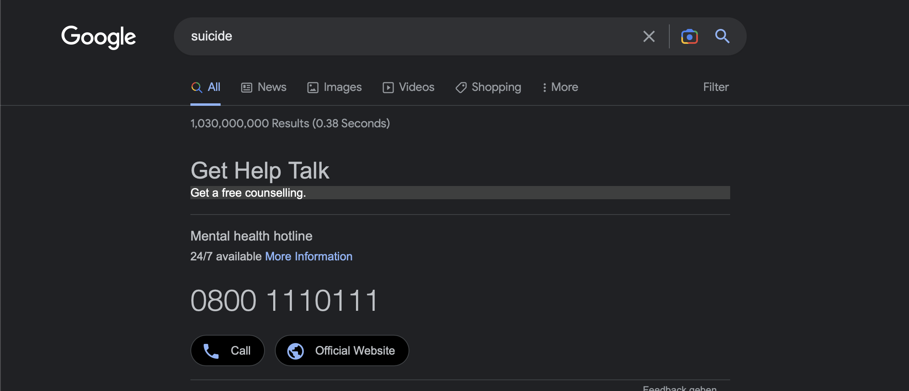

# Mental Health Analysis
**Goal:** Classify different kind of mental illnesses using social media posts

**Output**
Our goal is not to only predict the presence of a mental illness (binary), but also its kind.
We are planning to evaluate the correlation between different mental illness, to decide if we should either do multiclass or mutlilabel classification.

## How to use

### Install requirements
```
pip install -r requirements.txt
```

### Dataset Location
When running it in Google Colab, you have to place the data in a directory called `mental/data`in your Google Drive.

## Use case
Example: Recognise suicidal behaviour early and offer help


## Datasets
| Name | Source | Output | Availability | Link | Comment |
|------|--------|--------|--------------|------|---------|
| SMHD | Reddit | Multiclass: ADHD, Anxiety, Autism, Bipolar, Depression, Eating, OCD, PTSD, Schiophrenia | usage agreement https://tinyurl.com/56yfbvs3 | https://ir.cs.georgetown.edu/resources/smhd.html https://arxiv.org/pdf/1806.05258.pdf | Self reported |
| CLPsych 2015 | Twitter | Depression & PTSD | Request & letter from Institutional Review Board (unis ethic board) | https://github.com/clpsych/shared_task | - |
| Smal but Mighty: Affective Micropatterns for Quantifiying Mental health from Social Media Langauge | Twitter & Donated Data (https://OurDataHelps.org) | anxiety disorder, eating disorders, panic attacks, schizophrenia, suicde attempts | not available | https://aclanthology.org/W17-3110.pdf | very high quality data, but not available |
| Depression Detection | Twitter | Binary (Depression) | GitHub | https://github.com/swcwang/depression-detection | crawler available: idea is to adjust him to crawl also for other classes (ofmental illness) |
| Classification of mental illnesses on social media using RoBERTa | Reddit | Multiclass: adhd, anxiety, bipolar, depression, ptsd (subreddit names) | Google Drive https://github.com/amurark/mental-health-classification | https://aclanthology.org/2021.louhi-1.7.pdf | - |


* Those are just a few examples, but in general it is very hard to get good datasets, since its sensitive data.
* "Depression Detection" 
    * publishes an interesting approach to crawl posts from twitter
    * while assuring its quality
    * only binary (depression)
    * idea: extend it to different classes and other platforms

**Depression Detection's Collectiong data approach:**
1. Used twint to collect tweets based on the following hashtags
-    #depressed
-    #depression
-    #loneliness
-    #hopelessness1. 

2. Remove duplicated entries based on tweet id.

3. Remove entries that contain these positive or medical or educational sounding hashtags
-   #mentalhealth
-    #health
-    #happiness
-    #mentalillness
-    #happy
-    #joy
-    #wellbeing1. 

4. Remove entries with any of the following characteristics, as they are more likely to be promotional messages
 -  Containing more than three hashtags
-   Containing @mentions
-   Containing URLs

5. Remove entries with less than 25 characters, or 5 words.

6. Lastly, remove all hashtags from the tweets. This is because the hashtags themselves are an obvious indicator of depressive text, and we would like to train our model to focus on the content of the tweet rather than the existence of depressive hashtags.


## Model
As a model we are planning to fine tune a BERT model.

**BERT:**
* published 2019 by Devin (Google)
* "Bidirectional Encoder Representations from Transformers”
* also able to capture the context of both directions
* based on Transformer Architecture
    * maybe include picture of archtiecture (attention layers, Query, key, value...)
* already pre-trained and only needs to be fine-tuned 

**Fine Tuned BERTs**


## Papers
PsychBERT: https://ieeexplore.ieee.org/document/9669469#full-text-header
MentalBERT: Public Available Models: https://arxiv.org/pdf/2110.15621.pdf